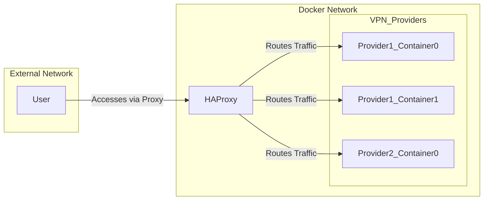

# Gluecannon

Gluecannon is a script that orchestrates the deployment and configuration of multiple gluetun VPN containers and a single HAProxy container that acts as a proxy for the VPN containers. It allows you to easily manage and scale your VPN setup using Docker Compose.

## Features

- Load configuration from a YAML file.
- Generate Docker Compose and HAProxy configuration files based on the loaded configuration.
- Manage (start, stop) VPN containers and HAProxy using Docker Compose.
- Run commands through the HAProxy.
- Start an interactive shell through the HAProxy.

## Usage

The script is invoked from the command line with an action argument. The available actions are:

- `up`: Start or restart the VPN containers and HAProxy.
- `down`: Stop the VPN containers and HAProxy.
- `list`: List the running services.
- `run`: Run a command through the HAProxy. This action requires an additional argument specifying the command to run.
- `interactive`: Start an interactive shell through the HAProxy.



Example usage:

```bash
python gluecannon.py up
python gluecannon.py run curl ifconfig.me
python gluecannon.py down
```

## Configuration

The script reads its configuration from a YAML file (`config.yml` by default). The configuration file specifies the global settings (like the proxy port and Docker image to use), and the settings for each VPN provider (like the number of containers to start and the environment variables to set).

## Dependencies

- Python 3.6 or later
- Docker
- Docker Compose
- Jinja2

## Installation

1. Clone the repository.
2. Install the dependencies.
3. Adjust the configuration file to your needs.
4. Run the script with the desired action.

## Contributing

Contributions are welcome. Please submit a pull request or create an issue to discuss the changes.

## License

This project is licensed under the MIT License.
